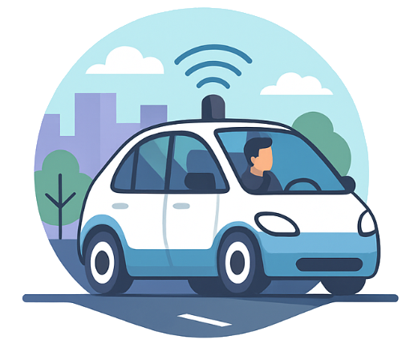
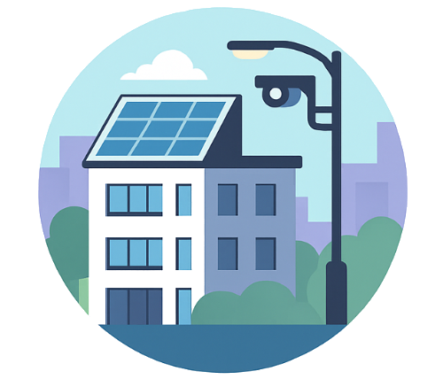

 

<h2 style="text-align:center; max-width:1500px; margin:3rem auto; line-height:1.6;">
  <strong>Urban Mobility Data Hub</strong> es un ecosistema de datos abierto y seguro para la movilidad urbana 
  que pretende facilitar la interoperabilidad entre actores públicos y privados, promoviendo el uso de estándares europeos y la soberanía del dato.
</h2>
<h2 style="text-align:center; max-width:1500px; margin:3rem auto; line-height:1.6;">

</h2>

  
  
Facilitar la <strong>coordinación de vehículos autónomos</strong> para el transporte de pasajeros y la distribución de mercancías mediante algoritmos avanzados basados en inteligencia artificial.

  
  
Optimizar el uso y mantenimiento de <strong>infraestructuras urbanas inteligentes</strong>, mejorando la eficiencia operativa y contribuyendo a la sostenibilidad medioambiental.

---

## **Our mission**
- Foster interoperability between public and private mobility actors.  
- Promote European data standards and data sovereignty.  
- Enable smart services and data-driven innovation in urban environments.

---

## **Core components**
- **Data Space Core** — Provider and Consumer EDC nodes for secure data exchange.  
- **Context Broker Layer** — Orion-LD brokers implementing NGSI-LD semantics.  
- **Security & Governance** — Keycloak identity federation and APISIX API Gateway with OIDC integration.  
- **Data Models & APIs** — TM Forum, NGSI-LD, and open ontologies for mobility data.  
- **Deployment** — Docker Compose and Kubernetes Helm charts for reproducible setups.

---

## **Project overview**
Developed within the framework of **ValgrAI** and **VRAIN (UPV)**, the Urban Mobility Data Hub aims to serve as a reference implementation for interoperable **Data Spaces** in the Valencian Region.  
It provides an open foundation for smart mobility initiatives, supporting collaboration among public administrations, companies, and research institutions.

---

## **Get started**
[Architecture overview](architecture.md) · [Deployment guide](deployment.md) · [API configuration](apis.md)

---

© 2025 Urban Mobility Data Hub — Powered by [ValgrAI](https://valgrai.eu/) and [VRAIN](https://vrain.upv.es/)

