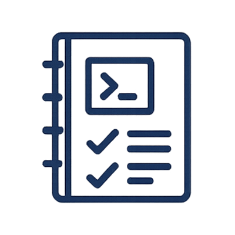
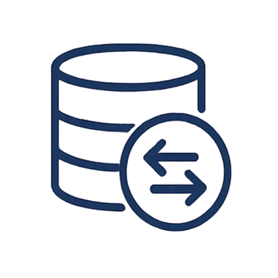
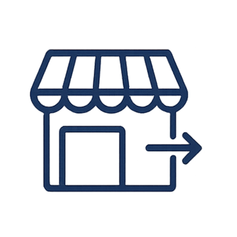
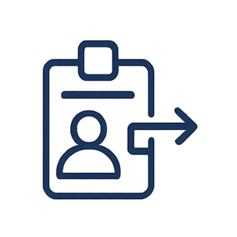

 

<h3 style="text-align:center; max-width:1500px; margin:3rem auto; line-height:1.6;">
  Urban Mobility Data Hub es un <strong>ecosistema de datos abierto y seguro para la movilidad urbana</strong> 
  que pretende facilitar la interoperabilidad promoviendo el uso de estándares europeos y la soberanía del dato.
</h3>

<h3 style="text-align:center; max-width:1500px; margin:-2rem auto 2rem; line-height:1.6;">
Proporciona una base abierta para el desarrollo de iniciativas de movilidad inteligente, impulsando la colaboración entre administraciones, empresas e instituciones de investigación y la adopción de soluciones sostenibles y basadas en datos.
</h3>

---

<h2 style="text-align:center; max-width:1500px;   margin: 5rem auto 2rem; line-height:1.6; font-size: 2rem; color: #005f87;">
Objetivos
</h2>

  
  
Facilitar la <strong>coordinación de vehículos autónomos</strong> para el transporte de pasajeros y la distribución de mercancías mediante algoritmos avanzados basados en inteligencia artificial.

  
  
Optimizar el uso y mantenimiento de <strong>infraestructuras urbanas inteligentes</strong>, mejorando la eficiencia operativa y contribuyendo a la sostenibilidad medioambiental.

---

<!--
<section class="getting-started">
  <h2>Cómo empezar</h2>
  

    Sigue estos tres pasos para integrarte en el ecosistema del <strong>Urban Mobility Data Hub</strong>.
  

  

    

      
      <h3>1. Registro</h3>
      
Conecta tu organización y obtén credenciales de acceso al entorno del Hub.

    

    

      
      <h3>2. Publicación</h3>
      
Registra tus activos de datos mediante el<strong> dataspace connector </strong> para compartirlos de forma segura.

    

    

      
      <h3>3. Consumo</h3>
      
Descubre y utiliza datasets disponibles dentro del ecosistema, integrándolos en tus aplicaciones.

    

  

</section>

---
-->
<section class="documentation-section">
  <h2>Documentación</h2>
  

    <a href="./stack" class="doc-card">
      
      <h3>Arquitectura</h3>
      
Visión general de la infraestructura y sus componentes principales.

    </a>

    <a href="./deploy-guide" class="doc-card">
      
      <h3>Guía de despliegue</h3>
      
Como desplegar el entorno paso a paso.

    </a>

    <a href="./tokens" class="doc-card">
      
      <h3>Uso del Dataspace</h3>
      
Publicar datasets, negociar y consumir datos dentro del entorno del Dataspace.

    </a>

    <a href="./security" class="doc-card">
      
      <h3>Seguridad y autenticación</h3>
      
Gestión de accesos y control de identidades con Keycloak y OIDC y control de acceso por políticas.

    </a>

    <a href="./marketplace" class="doc-card">
      
      <h3>Marketplace</h3>
      
Publica, descubre y comparte activos de datos en el ecosistema.

    </a>

    <a href="./onboarding" class="doc-card">
      
      <h3>Onboarding</h3>
      
Como formar parte del espacio de datos.

    </a>

  

</section>

<footer class="site-footer">
  

    2025 Urban Mobility Data Hub — Powered by 
    <a href="https://valgrai.eu/" target="_blank">ValgrAI</a> and 
    <a href="https://vrain.upv.es/" target="_blank">VRAIN</a>
  

</footer>

